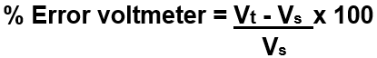
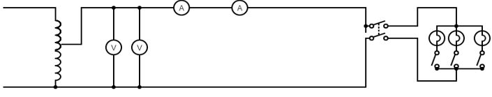

The calibration is the process of checking the accuracy of the result by comparing it with the standard value.  In other words, calibration checks the correctness of the instrument by comparing it with the reference standard.  It helps us in determining the error occurring in the reading and adjusts the voltages for getting the ideal reading. <h4>Percentage Error:  [(T-S)/S]*100 </h4>
  where : T= Test value 
              S= Standard value
 <h3>Calibration of voltmeter:</h3> Calibration of Voltmeter is the process of checking the accuracy of the reading of the Voltmeter under  test (Vt) by comparing it with the standard 
Voltmeter (Vs) one.  In other words, calibration checks the correctness of the instrument by comparing it with the reference standard

where :    Vt = Test value       Vs = Standard value
<h3>Calibration of ammeter:</h3> 
Calibration of Ammeter is the process of checking the accuracy of the reading of the ammeter under  test (At) by comparing it with the standard 
Ammeter (As) one.  In other words, calibration checks the correctness of the instrument by comparing it with the reference standard 
%Error Ammeter =  [(  At - As )/ As ]x100 
where :    At = Test value       As = Standard value 
 <h2>Circuit Diagram.</h2>

 
  
