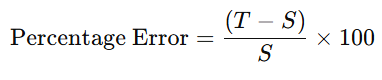
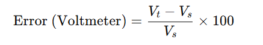
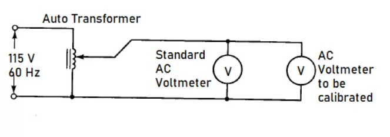
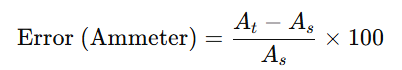
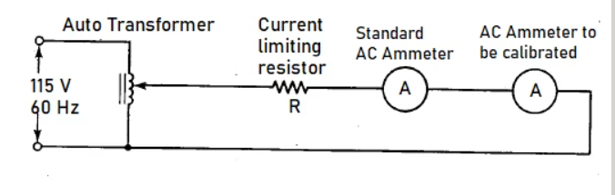

Calibration is the objectives of determining the accuracy of an instrument or measurement system by comparing its readings with those of a known, standard reference. If any deviation is observed, adjustments are made to ensure the instrument provides accurate and reliable measurements.                                                                                                     
  The main purposes of calibration are:

1. Accuracy: To ensure the instrument gives correct measurements.

2. Reliability: To maintain consistent readings over time.

3. Error Detection: To identify any deviations or faults in the instrument.  

 
where,  
T = Test value  
S = Standard value   

<b>Calibration of voltmeter :</b>  
Calibration of Voltmeter is the process of checking the accuracy of the reading of the Voltmeter under test (Vt) by comparing it with the standard Voltmeter (Vs) one. In other words, calibration checks the correctness of the instrument by comparing it with the reference standard.   

 
where,  
Vt = Test value  
Vs = Standard value  
 
Figure 1.0 Calibration of an AC voltmeter

<b>Calibration of ammeter :</b>  
Calibration of Ammeter is the process of checking the accuracy of the reading of the ammeter under test (At) by comparing it with the standard Ammeter (As) one. In other words, calibration checks the correctness of the instrument by comparing it with the reference standard.   
 
where, 
At = Test value  
As = Standard value  
 
Figure 1.1 Calibration of an AC ammeter

 
  
